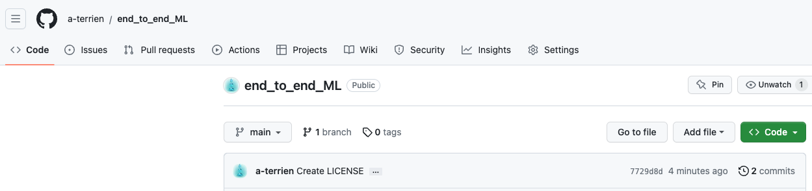
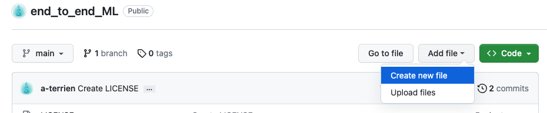
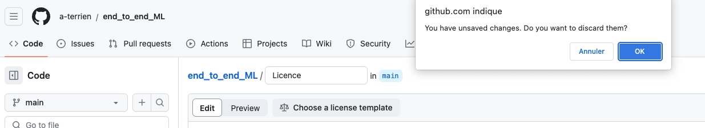
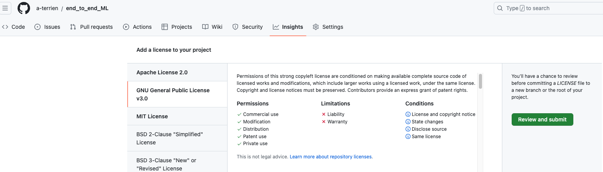
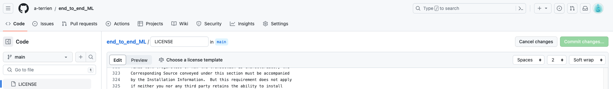
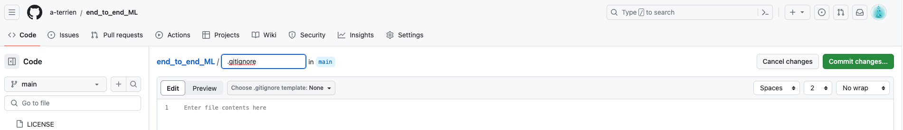
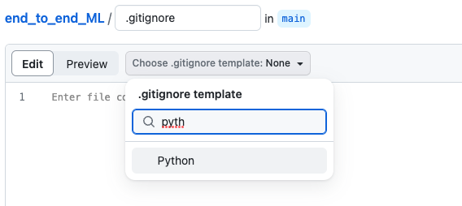
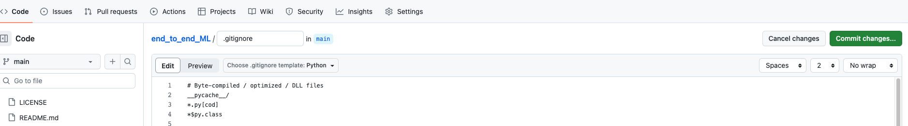
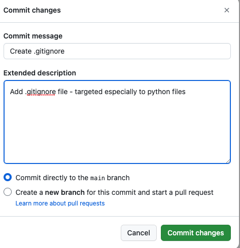
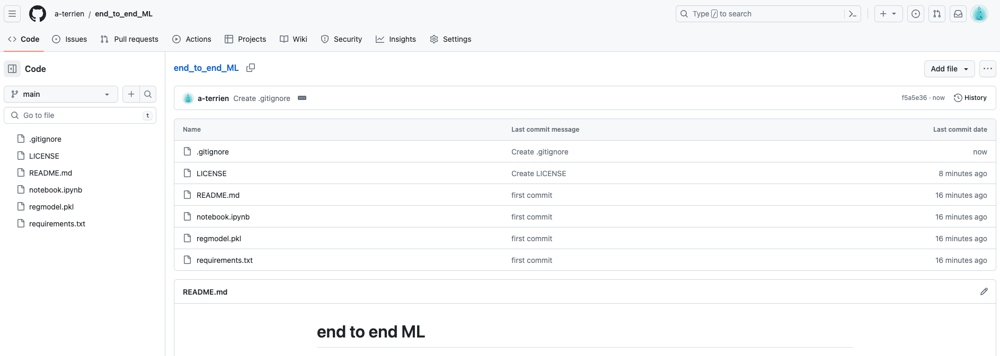

# end to end ML

Install git cli
Install vscode
Log in github


echo "# end to end ML" >> README.md
git init
git add .
git commit -m "first commit"
git branch -M main
git remote add origin https://github.com/a-terrien/end_to_end_ML.git
git push origin main
a

or git clone https://github.com/a-terrien/end_to_end_ML.git

Then to add licence and gitignore fill, go on the github repository:
go in the tab "Code"





















```
git fetch
git pull origin main 
git add .
git commit -m "Added an image in README.md"
git push --set-upstream origin main 
```

### Classification thing Prediction 

### Software and Tools Requirements
1. [Github Account](https://github.com)
2. [VS Code IDE](https://code.visualstudio.com/)
3. [Heroku Account](https://heroku.com) - Not free
4. [GitCLI](https://git-scm.com/book/en/v2/Getting-Started-The-Command-Line)

### Create a new environnement

It is good practice to create a new environnement each time you have a new project.
I created a conda environment. 

`conda create --name end_to_end_ML python==3.9 -y`
or
`conda create -p end_to_end_ML python==3.7 -y`

Say yes to everything

`conda activate end_to_end_ML`

Si ce n'est pas déjà fait: 
```
git config --global user.name "My name"
git config --global user.email "myemailaddress@company.com"
# Check if the information was saved correctly
git config`--global --list
#if you want to have a local information
git config --local ...
```

```
# Updates all the modification/creation/deletion done in the local repository
git add .

# Creates an explanation or message for the previous action 
git commit -m "message around files has being modified, added or deleted" 

# Updates the github distant repository linked to the local one
git push 

# Verify actions were correctly done
git status
git log

```
if you want more informations on git commands, go directly on the official documentation such as :
[link](https://www.atlassian.com/git/tutorials/setting-up-a-repository). 